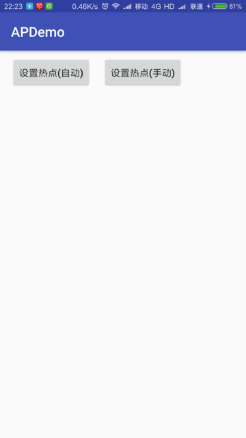
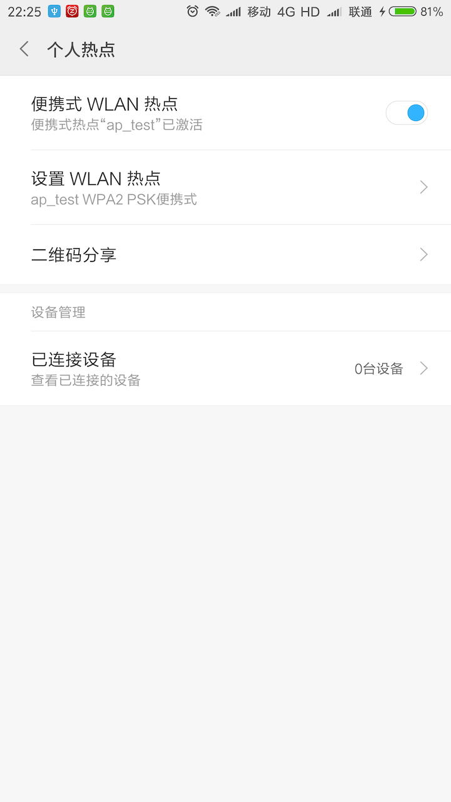
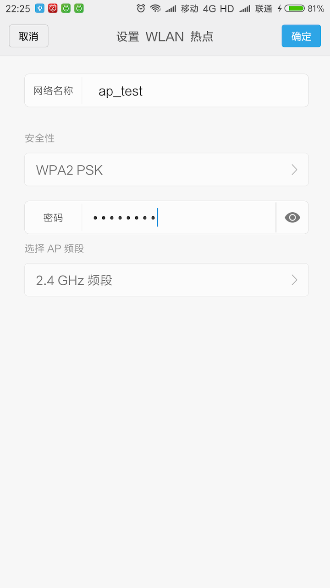

# APDemo
Android WiFi热点完全研究(自定义创建、跳转系统界面设置、读取配置、切换，Android6.0适配)
http://www.cnblogs.com/fly263/p/7341768.html

> 布局文件使用了ConstraintLayout，如果没有安装，需要在Android Studio中点击File-Settings-System Settings-Android SDK，切换到SDK Tools标签页，下载ConstraintLayout for Android、Solver for ConstraintLayout两个支持库

# Demo UI

# System UI(From MIUI 9)
&nbsp;&nbsp;
